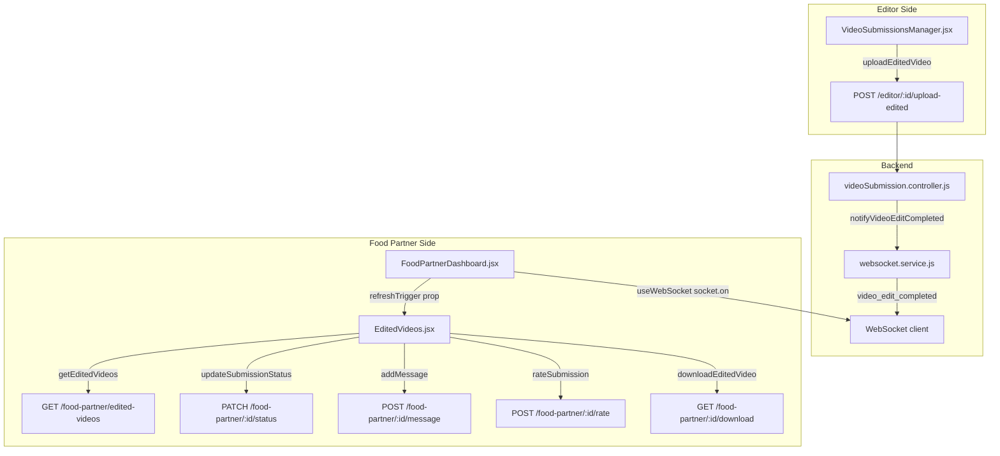

# Design Document: Video Delivery — Food Partner

## Overview

This feature completes the end-to-end video editing delivery loop in ReelZomato. When an editor finishes editing and uploads the result, the editor sees a clear confirmation inside the upload modal. The food partner's dashboard surfaces the video in real time via WebSocket, shows it in the "Edited Videos" tab with filter tabs, and lets the food partner approve, request a revision, and rate the work.

All backend endpoints already exist and are functional. The work is entirely frontend-side changes to three files plus their CSS, with no new API routes or backend logic required.

### Key Design Decisions

- **No new service methods needed.** `videoSubmissionService.js` already exposes `getEditedVideos`, `downloadEditedVideo`, `rateSubmission`, `updateSubmissionStatus` (food-partner variant), and `addMessage`. The design reuses these directly.
- **Local state drives UI transitions.** After approve/revision/rating actions succeed, the component updates its local `editedVideos` array rather than re-fetching, keeping the UI snappy.
- **Badge count is ephemeral in-memory state.** It lives in `FoodPartnerDashboard` state and resets to zero when the user navigates to the "Edited Videos" tab. It is not persisted.
- **2-second auto-close uses `setTimeout` with cleanup.** The ref is stored so it can be cleared if the modal is manually closed before the timer fires.
- **WebSocket listener is registered in `FoodPartnerDashboard`**, not inside `EditedVideos`, because the badge and toast logic lives at the dashboard level. `EditedVideos` receives a `refreshTrigger` prop (a counter) that it watches to re-fetch.

---

## Architecture



---

## Components and Interfaces

### VideoSubmissionsManager.jsx — changes

**Modified function: `handleUploadEditedVideo`**

```
State added:
  uploadSuccess: boolean  — true after a successful upload, drives confirmation UI

Behaviour:
  1. On success: set uploadSuccess = true, start a 2-second setTimeout
  2. After 2 seconds: set uploadModalSubmission = null, uploadSuccess = false
  3. Store the timeout ref so manual close can clear it
  4. On error: set error message, do NOT set uploadSuccess, do NOT start timer
  5. Modal renders "✓ Sent to Food Partner" banner when uploadSuccess is true
  6. Upload button and file picker are hidden while uploadSuccess is true
```

### EditedVideos.jsx — changes

**New state:**
```
activeFilter: 'all' | 'review' | 'completed'
actionLoading: { [submissionId]: boolean }
actionError: { [submissionId]: string | null }
revisionMode: { [submissionId]: boolean }
revisionNote: { [submissionId]: string }
```

**New prop:**
```
refreshTrigger: number  — incremented by FoodPartnerDashboard on video_edit_completed
```

**Filter logic:**
```
filteredVideos = activeFilter === 'all'
  ? editedVideos
  : editedVideos.filter(v => v.status === activeFilter)
```

**`handleApprove(submissionId)`:**
```
1. Set actionLoading[submissionId] = true, clear actionError[submissionId]
2. Call updateSubmissionStatus(submissionId, 'completed', undefined, 'food-partner')
3. On success: update local editedVideos entry status to 'completed'
4. On error: set actionError[submissionId]
5. Finally: set actionLoading[submissionId] = false
```

**`handleRevisionSubmit(submissionId)`:**
```
1. Set actionLoading[submissionId] = true, clear actionError[submissionId]
2. Call updateSubmissionStatus(submissionId, 'revision_requested', undefined, 'food-partner')
3. Call addMessage(submissionId, revisionNote[submissionId], 'food-partner')
4. On success: update local entry status to 'revision_requested', clear revisionMode
5. On error: set actionError[submissionId]
6. Finally: set actionLoading[submissionId] = false
```

**Rating form visibility rule:**
```
Show rating form iff: video.status === 'completed' && !video.rating
```

### FoodPartnerDashboard.jsx — changes

**New state:**
```
editedVideosBadge: number   — count of unread video_edit_completed events
editedVideosRefreshTrigger: number  — incremented to signal EditedVideos to re-fetch
toastNotification: { message: string, id: number } | null
```

**WebSocket effect (added alongside existing order listeners):**
```javascript
useEffect(() => {
  if (!socket) return;
  const handleVideoEditCompleted = (data) => {
    if (activeTab === 'edited-videos') {
      setEditedVideosRefreshTrigger(n => n + 1);
    } else {
      setEditedVideosBadge(n => n + 1);
    }
    setToastNotification({
      message: `Your edited video for '${data.projectTitle}' is ready for review.`,
      id: Date.now()
    });
  };
  socket.on('video_edit_completed', handleVideoEditCompleted);
  return () => socket.off('video_edit_completed', handleVideoEditCompleted);
}, [socket, activeTab]);
```

**Badge reset on tab switch:**
```javascript
// Inside the nav item click handler, when switching to 'edited-videos':
setEditedVideosBadge(0);
```

**Toast auto-dismiss:** Toast disappears after 4 seconds via a `useEffect` that watches `toastNotification.id`.

---

## Data Models

No new data models. The existing `VideoSubmission` MongoDB document already has all required fields:

```
VideoSubmission {
  _id
  projectTitle: string
  status: 'submitted' | 'assigned' | 'in_progress' | 'review' | 'completed' | 'revision_requested' | 'rejected'
  foodPartner: ObjectId → FoodPartner
  editor: ObjectId → User
  editedVideo: {
    filename: string
    originalName: string
    fileSize: number
    mimeType: string
    filePath: string
    uploadedAt: Date
  }
  rating: number (1–5, optional)
  feedback: string (optional)
  messages: [{ sender: 'editor'|'foodPartner', message: string, timestamp: Date }]
  budget: number
  deadline: Date
}
```

**WebSocket event payload (`video_edit_completed`):**
```
{
  type: 'video_edit_completed',
  submissionId: string,
  editorId: string,
  foodPartnerId: string,
  editedVideo: { filename, fileSize, mimeType, uploadedAt },
  timestamp: string
}
```

Note: The `projectTitle` is not in the current `notifyVideoEditCompleted` payload. The backend `websocket.service.js` call in `uploadEditedVideo` controller needs to include `projectTitle` in the `editedVideoData` argument, or the frontend must look it up from local state by `submissionId`. The simpler approach: pass `projectTitle` from the controller when calling `notifyVideoEditCompleted`.

---

## Correctness Properties

*A property is a characteristic or behavior that should hold true across all valid executions of a system — essentially, a formal statement about what the system should do. Properties serve as the bridge between human-readable specifications and machine-verifiable correctness guarantees.*

### Property 1: Upload confirmation message is shown before modal closes

*For any* successful edited video upload, the upload modal should display a "Sent to Food Partner" confirmation state before it closes, and should not close immediately on success.

**Validates: Requirements 1.1, 1.3**

---

### Property 2: Upload modal stays open on error

*For any* failed edited video upload (network error or server error), the upload modal should remain open and display an error message, and no auto-close timer should be started.

**Validates: Requirements 1.4**

---

### Property 3: Edited video cards render all required fields

*For any* list of submissions returned by the API, every rendered video card should display the project title, editor name, upload date of the edited video, file size, and a status badge.

**Validates: Requirements 2.1, 2.5**

---

### Property 4: Filter tabs correctly partition the list

*For any* list of submissions with mixed statuses, selecting the "Under Review" tab should display only submissions with status `review`, selecting "Completed" should display only submissions with status `completed`, and selecting "All" should display all submissions.

**Validates: Requirements 2.6**

---

### Property 5: Download button is disabled during download

*For any* submission, while its download is in progress, the "Download" button for that card should be disabled and show a loading spinner, and buttons for other cards should be unaffected.

**Validates: Requirements 3.2**

---

### Property 6: Approve and Revision buttons shown iff status is review

*For any* submission, the "Approve" and "Request Revision" buttons should be visible if and only if the submission's status is `review`. For any other status (including `completed`), these buttons should not be rendered.

**Validates: Requirements 4.1, 4.7**

---

### Property 7: Revision submission triggers both API calls

*For any* revision note text submitted by the food partner, both `updateSubmissionStatus` (with `revision_requested`) and `addMessage` (with the note text) should be called for the same submission ID.

**Validates: Requirements 4.4**

---

### Property 8: Action buttons disabled during in-flight requests

*For any* submission, while an approve or revision request is in flight, both the "Approve" and "Request Revision" buttons for that card should be disabled.

**Validates: Requirements 4.5**

---

### Property 9: Rating form shown iff completed and unrated

*For any* submission, the star rating form should be visible if and only if the submission's status is `completed` AND the submission has no existing `rating` field. If either condition is false, the form should not be shown (and if a rating exists, the read-only star display should be shown instead).

**Validates: Requirements 5.1, 5.6**

---

### Property 10: Rating form replaced by read-only display after submission

*For any* successful rating submission, the rating form should be replaced by a read-only star display showing the submitted rating value, and the form should no longer be visible.

**Validates: Requirements 5.3**

---

### Property 11: Toast notification shown for any video_edit_completed event

*For any* `video_edit_completed` WebSocket event received by the food partner dashboard, a toast notification should be displayed containing the project title from the event payload.

**Validates: Requirements 6.1**

---

### Property 12: Badge increments when not on edited-videos tab

*For any* number of `video_edit_completed` events received while the active tab is not `edited-videos`, the badge count on the "Edited Videos" nav item should equal the number of such events received since the last time the tab was active.

**Validates: Requirements 6.3**

---

### Property 13: WebSocket listener registered on mount and cleaned up on unmount

*For any* mount/unmount cycle of `FoodPartnerDashboard`, the `video_edit_completed` listener should be registered exactly once on mount and removed exactly once on unmount, with no listener leaks across re-renders.

**Validates: Requirements 6.4**

---

## Error Handling

| Scenario | Component | Behaviour |
|---|---|---|
| Upload fails | VideoSubmissionsManager | Show error in modal, keep modal open, no auto-close |
| Fetch fails | EditedVideos | Show error message + Retry button |
| Download fails | EditedVideos | Re-enable button, show inline error on card |
| Approve fails | EditedVideos | Re-enable action buttons, show inline error on card |
| Revision submit fails | EditedVideos | Re-enable action buttons, show inline error on card |
| Rating submit fails | EditedVideos | Keep form visible, show inline error |
| Rating without star selected | EditedVideos | Show validation message, do not call API |
| WebSocket disconnected | FoodPartnerDashboard | Existing reconnect logic in `useWebSocket` handles this; badge/toast only fire on received events |

All inline errors are scoped per-card using the `actionError` map keyed by `submissionId`, so one card's error does not affect others.

---

## Testing Strategy

### Unit Tests

Focus on specific examples, edge cases, and integration points:

- `VideoSubmissionsManager`: upload success shows confirmation text; upload failure keeps modal open
- `EditedVideos`: empty state renders correct message; error state renders Retry button; rating form hidden when `rating` field exists; approve button absent for `completed` status
- `FoodPartnerDashboard`: badge resets to 0 when navigating to edited-videos tab

### Property-Based Tests

Use **fast-check** (already compatible with Vitest, which the project uses).

Each property test runs a minimum of **100 iterations**.

Tag format: `// Feature: video-delivery-foodpartner, Property N: <property text>`

**Property 3 — Card rendering:**
Generate random arrays of submission objects with random statuses and editedVideo data. For each, render the card and assert all required fields are present in the output.

**Property 4 — Filter tabs:**
Generate random arrays of submissions with statuses drawn from `['review', 'completed']`. For each filter value, assert the filtered list contains exactly the submissions matching that status.

**Property 6 — Approve/Revision button visibility:**
Generate random submission objects with arbitrary status values. Assert buttons are present iff `status === 'review'`.

**Property 7 — Revision triggers both calls:**
Generate random submission IDs and revision note strings. Mock both service methods. Assert both are called with the correct arguments.

**Property 8 — Buttons disabled during in-flight:**
Generate random submission IDs. Simulate an in-flight action state. Assert both buttons have the `disabled` attribute.

**Property 9 — Rating form visibility:**
Generate random submissions with combinations of `status` and presence/absence of `rating`. Assert form visibility matches the rule `status === 'completed' && !rating`.

**Property 12 — Badge count:**
Generate a random number N of `video_edit_completed` events fired while not on the edited-videos tab. Assert badge count equals N.

**Property 13 — Listener lifecycle:**
Mock the WebSocket `on`/`off` methods. Mount and unmount the component. Assert `on('video_edit_completed', ...)` called once and `off('video_edit_completed', ...)` called once with the same handler reference.
